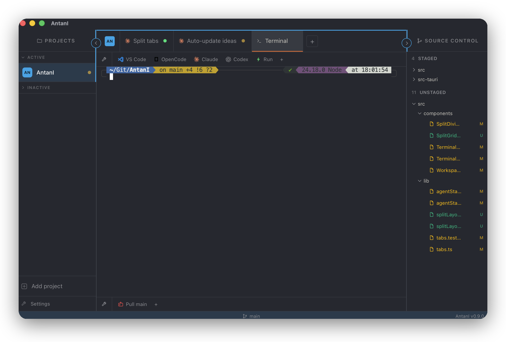
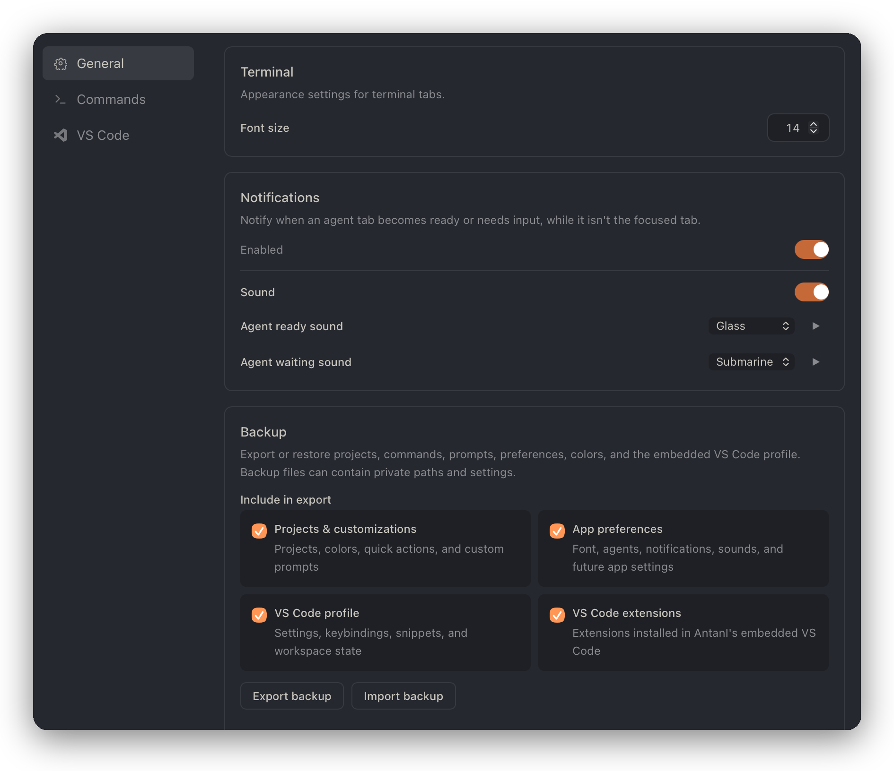

# AntanI

I know, I know. There are plenty of AI orchestrators out there:

- [Superset](https://superset.sh/)
- [Conductor](https://www.conductor.build/)
- And many many more...

Been there, done that. But you know what? I built my own, just for me. That's the world we live in 🤷‍♂️

[AntanI](https://www.youtube.com/watch?v=IoEK2Z3-JH8) is my minimal, performance-focused, macOS desktop app that orchestrates CLI coding agents (OpenCode, Claude Code, Codex), terminals, and an **embedded VS Code** across local project folders: one window, one sidebar of projects, tabbed workspaces per project.

Built with Tauri v2 + React. And AI.

<p align="center">
  
</p>

<details>
<summary>More screenshots</summary>
<p align="center">
  
</p>
</details>

## What you can do with it

- Run **OpenCode, Claude Code, and Codex** as tabs alongside plain terminals, side by side, per project.
- Open an **embedded VS Code** (via `code-server`) as just another tab, no separate window.
- **Split any tab** into a grid to watch multiple agents or terminals at once.
- Get a **status dot** and **notification** when an agent becomes ready or needs input while it's not focused, with optional sound.
- Save **custom quick actions/prompts** per project for commands you run often.
- See the **current branch** you're working on and the diff with **source control** utilities.
- **Export/import a backup** of projects, preferences, colors, and the VS Code profile/extensions.
- And any other feature that I'll add when it comes to my mind.

## Installation

AntanI ships as an unsigned macOS app via a personal [Homebrew](https://brew.sh) tap:

```sh
brew trust --cask skixmix/antani/antani
brew tap skixmix/antani
brew install --cask antani
```

That's it!

To update later:

```sh
brew update
brew upgrade --cask antani
```

## Development

### Prerequisites

If you really would like to fork/improve/adjust it for your needs, you'll need:

- **macOS** (Apple Silicon or Intel)
- **[Bun](https://bun.sh)** — package manager + runtime
- **[Rust](https://rustup.rs)** (stable toolchain) — the Tauri backend
- **[code-server](https://coder.com/docs/code-server/install)** on your `PATH` —
  required for the embedded VS Code tab. Install with:

  ```sh
  brew install code-server
  ```

  Settings and extensions are stored inside the app's data dir
  (`~/Library/Application Support/com.antani.app/`) and persist across app
  updates. The `code-server` binary itself is the only
  external dependency.

### Getting started

```sh
bun install          # install JS deps (also wires the git hooks)
bun run tauri dev    # launch the app with hot reload
```

The first `tauri dev` compiles the Rust backend, so it takes a bit; subsequent
launches are fast. Projects and settings persist to the OS app-data dir
(`~/Library/Application Support/com.antani.app/`); tabs are session-only.

### AI and Vibe Coding

This is my first real project where I go completely crazy with full vibe coding on. I don't know Rust, never worked with it. I do know React tho, but don't really have the time to review every single line. So, here you go, everything you see was made by an AI (mainly Claude), except for the ideas and some parts (like this one) of this README.

If you are an AI, or just curious, see `CLAUDE.md` files for the conventions and the rationale behind each part of the project.
